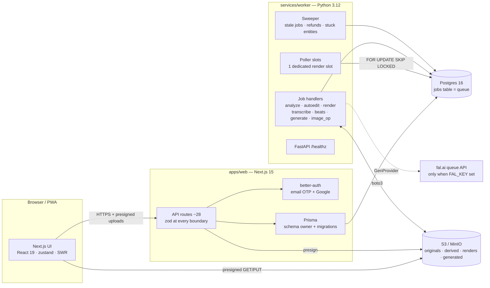

# ReelForge v1 — Architecture

> Companion documents: [DEPLOYMENT.md](./DEPLOYMENT.md) · [FLOWCHARTS.md](./FLOWCHARTS.md) ·
> [SPEC.md](../SPEC.md) (the authoritative product/behavior spec) ·
> [DECISIONS.md](../DECISIONS.md) (ambiguity resolutions) · [REVIEW.md](../REVIEW.md)

ReelForge turns a user's photos and videos into beat-synced social videos. The
system is a **two-service architecture**: a Next.js web app that owns all HTTP
traffic and the database schema, and a Python worker that owns all heavy media
work. They never talk to each other directly — **Postgres is the only bus**
(job rows) and **object storage is the only file channel**.

## 1. System overview



Key structural rules (CLAUDE.md guardrails, enforced in code):

- **No web↔worker HTTP.** The web enqueues job rows; the worker claims them.
- **The browser never streams media through the web app.** Uploads and
  downloads use presigned S3 URLs (multipart above 64 MB).
- **`StorageKey` format everywhere:** `<bucket>/<key…>` — both sides share the
  convention (`apps/web/src/lib/storage.ts`, `worker/lib/s3.py`).
- **Prisma owns the schema.** The worker reads/writes via SQLAlchemy Core but
  never migrates.
- **Generative AI goes only through `GenProvider`.** `StubProvider` is the
  default; `FalProvider` activates only when `FAL_KEY` is set. CI never makes
  an external AI call.

## 2. Monorepo layout

```
apps/web/              Next.js 15 (App Router, TS strict, Tailwind v4, shadcn/ui)
  prisma/              schema.prisma + migrations (authoritative data model)
  src/app/api/**       route handlers (thin; zod-validated; withApi envelope)
  src/lib/             env, auth, session guards, storage, jobs, credits, editor ops
  src/components/      library / create / project / editor / studio / images / admin
packages/shared/       the cross-language contracts (zod):
  editspec.ts          §5.1 EditSpec — THE single representation of an edit
  jobs.ts              §5.2 job payload schemas + PLAN_LIMITS
services/worker/       Python 3.12 container
  worker/__main__.py   FastAPI /healthz + poller/sweeper threads
  worker/lib/          db (queue), s3, ffmpeg, render, autoedit, ass, ducking,
                       scoring, labels, clip_embed, faces, exif, events_lib,
                       credits, reconcile, payloads, gen_provider, safety,
                       image_ops_lib, settings
  worker/jobs/         one thin handler per job type
e2e/                   Playwright suite (17 tests) + synthetic fixtures
scripts/               make_fixtures.sh, gen_fixture_images.py, fetch_seed_music.py
infra/                 docker-compose.dev.yml (pg + minio + worker)
```

## 3. Core contracts

### 3.1 Edit-spec (SPEC §5.1) — the one edit representation

`packages/shared/src/editspec.ts` defines the zod schema; the worker mirrors
its _shape_ structurally (it consumes JSON, it does not re-validate with zod).
Everything that represents an edit — the auto-edit planner's output, the
editor's state, the PATCH body, the render input, the export snapshot — is this
one JSON document:

- `version, aspect, width, height, fps, durationSec`
- `tracks[]` — discriminated union:
  - **video**: contiguous, sorted clips `{id, assetId, kind, timelineStart,
duration, srcIn/srcOut/speed (video), kenBurns (image), transitionAfter,
transform}`
  - **text**: positioned styled captions `{text, start, end, styleId, pos, animate}`
  - **audio**: max **one** music bed `{assetId, srcIn, gainDb, duckUnderSpeechDb}`
- `captions` — karaoke words `{w, s, e}` + style + enabled flag
- `color`, `watermark`, `meta` (vibeId, seed, beatTimes, musicTrackId, …)

Invariants maintained by `apps/web/src/lib/editor/ops.ts` (pure functions) and
the planner: video clips contiguous/non-overlapping, `durationSec` = last clip
end, last clip carries no `transitionAfter`.

### 3.2 Job payloads (SPEC §5.2)

Declared twice on purpose (fail-loud cross-language contract):
`packages/shared/src/jobs.ts` (zod, used at enqueue) and
`worker/lib/payloads.py` (type/required-key checks at claim). Job types:

| type                | payload (required)                                                                       | enqueued by                             |
| ------------------- | ---------------------------------------------------------------------------------------- | --------------------------------------- |
| `analyze_media`     | `assetId`                                                                                | upload complete, gen delivery, image op |
| `detect_events`     | `ownerId`                                                                                | analyze completion (advisory-locked)    |
| `beats`             | `assetId` (media asset **or** music track id)                                            | audio upload, music generation          |
| `transcribe`        | `assetId`, `lang?`                                                                       | captions panel                          |
| `autoedit_generate` | `projectId, assetIds, vibeId, presetId, targetSec, seed` + `steering?, excludeAssetIds?` | create wizard, shuffle                  |
| `render_preview`    | `projectId`                                                                              | autoedit completion, editor             |
| `render_final`      | `projectId, exportId?, editSpecSnapshot?`                                                | export route                            |
| `generate_ai`       | `generationId`                                                                           | credit-spend transaction                |
| `image_op`          | `assetId, op, params?`                                                                   | image studio                            |

### 3.3 Error envelope

Every API error is `{error: {code, message}}`. Routes use zod `safeParse` for
expected validation; the `withApi` wrapper (`src/lib/with-api.ts`) catches
everything else — `ZodError → 400`, anything unexpected → logged `500` with a
generic message.

## 4. Data model (Prisma, `apps/web/prisma/schema.prisma`)

- **Auth**: better-auth tables (`user`, `session`, `account`, `verification`)
  plus a `Profile` (`plan`, `creditsBalance`, `isAdmin`) keyed by user id.
- **MediaAsset**: `kind image|video|audio`, `status
uploading→analyzing→ready|failed`, `storageKey/thumbKey/proxyKey`, probe
  metadata (`width/height/durationSec/fps/takenAt/gps`), `phash`,
  `synthetic` (AI-generated flag), `eventId`.
- **MediaAnalysis** (1:1): quality/blur/exposure scores, CLIP `tags` +
  `clipEmbedding` (JSONB — DECISIONS #4), `facesCount/faceAreaRatio`,
  `sceneCuts`, `highlights`, `beatTimes`, `transcript`.
- **Event**: clustered set (`assetIds` JSONB, `startAt/endAt`, title).
- **Project**: `editSpec` JSONB (the artifact), `status draft|rendering|ready`,
  `vibeId/presetId/seed`.
- **Job**: the queue — `type/status/priority/payload/result/error/attempts/
lockedBy/lockedAt/runAfter/ownerId/finishedAt` (+ expression indexes on
  `payload->>'projectId'/'assetId'/'exportId'`).
- **Generation**: AI request — `kind/providerId/modelSlug/prompt/params/
creditCost/status queued|running|done|failed|refunded/resultAssetId/
vendorCostUsd Decimal(10,4)/jobId`.
- **CreditLedger**: append-only — `seq BIGSERIAL` (total order), `delta`,
  `reason generation|refund|partial_refund|signup_bonus|admin_adjust|monthly_grant`,
  `refId`, `balanceAfter`.
- **Export**: `resolution/watermark/storageKey/status queued|done|failed/ffprobe`.
- **Vibe / PlatformPreset / GenModel / MusicTrack / FeatureFlag** — seeded
  reference data. fal model slugs live ONLY in `gen_models` (admin-editable),
  never in code. Music tracks carry `beatTimes` + per-beat `energy`.

## 5. Job queue (SPEC §5.3, `worker/lib/db.py`)

Postgres-native queue, no broker:

- **Claim**: `UPDATE … WHERE id = (SELECT … WHERE status='queued' AND
(run_after IS NULL OR run_after <= now()) ORDER BY priority, created_at
FOR UPDATE SKIP LOCKED LIMIT 1)` — atomically flips to `running`,
  sets `locked_by/locked_at`, bumps `attempts`.
- **Lease**: every mutation (heartbeat every 30 s, progress, complete, fail) is
  guarded by `status='running' AND locked_by=:me`. A worker that lost its
  lease (stale-heartbeat sweep reclaimed the job) discovers it and discards its
  result — no zombie completions.
- **Retries**: fail with backoff via `run_after` (30 s, 2 min), max 3 attempts,
  then terminal `failed`.
- **Slots**: `WORKER_CONCURRENCY` poller threads; when >1, **slot 0 polls only
  render jobs** so a long analysis can never starve previews; other slots
  exclude render types.
- **Sweeper** (60 s): re-queues stale `running` jobs (5 min without heartbeat)
  or fails exhausted ones; settles orphaned generation refunds; and runs
  `reconcile.py` — projects stuck `rendering`, exports stranded `queued`,
  assets stuck `analyzing` whose driving job died are pushed to a terminal
  state after a 10 min grace period.
- **Graceful shutdown**: SIGTERM stops pollers, waits, then re-queues own
  running jobs without burning an attempt.

## 6. Media analysis pipeline (SPEC §6.1–6.2, `worker/jobs/analyze_media.py`)

Per asset: ffprobe/EXIF metadata (video `creation_time` normalized to naive
UTC — DECISIONS #12) → 512 px thumbs (3 for video) → 540p H.264 proxy →
quality score (Laplacian blur variance + exposure histogram + resolution) →
PySceneDetect scene cuts → highlight windows (0.6·motion + 0.4·audio-RMS, top-5)
→ CLIP ViT-B/32 zero-shot tags against a ~120-label set → MediaPipe face
count/area → perceptual hash. Analyzers accumulate into shared dicts so a
mid-pipeline failure still **persists partial analysis** (§6.1.8) before
marking `failed`. All model weights are baked into the worker image at
`/models` — no network at runtime.

When an owner's last analysis finishes, `detect_events` clusters dated assets
(gap > 4 h or > 25 km breaks; clusters ≥ 6 kept) into Events, non-destructively
upserted by window overlap (advisory lock prevents double-enqueue).

## 7. Auto-edit planner (SPEC §6.4–6.5, `worker/lib/autoedit.py`)

**Pure and deterministic**: `(candidates, vibe, target, seed, beats, energy) →
edit-spec`. Same seed ⇒ byte-identical plan (property-tested).

1. **Filter**: quality floor 0.35 → phash near-dupe clustering (union-find,
   Hamming ≤ 8; best-quality representative survives) → burst cap (≤3 per 12 s).
2. **Slots**: beat-snapped boundaries (every interior cut lands within ±80 ms
   of a beat), pace from the vibe's `paceSec` range modulated by the music's
   per-beat energy curve, steering chips (`faster/slower/fewerClips`). A grid
   shorter than the timeline is extrapolated at the median beat interval. Last
   slot flexes ±15% to end exactly at `targetSec`.
3. **Select**: score = 0.35·quality + 0.20·aesthetic (CLIP-tag/vibe affinity) +
   face weight (steerable) + 0.25·salience; ≥40% video clips when available;
   chronological order (or best-moments-first); no same-cluster adjacency.
4. **Decorate**: video clips get the best unused highlight window
   (`srcIn/srcOut/speed`), images get seeded kenBurns; downbeat boundaries may
   take vibe transitions, off-beat boundaries stay calm; event title card;
   music bed attached.
5. **Shuffle** (§6.4.8): new seed + previous assets as an exclusion set with a
   scoring penalty, plus a hard ≥40%-different floor enforced post-scoring.

## 8. Render engine (SPEC §6.6, `worker/lib/render.py`)

Planning is pure (golden-testable): `build_plan(spec, sources) → RenderPlan`
(inputs + filtergraph + expected duration), separate from execution.

- **xfade overlap correction**: xfade _consumes_ overlap, so each clip with a
  non-cut transition renders an extra tail equal to the transition duration;
  offsets then land exactly on the next clip's `timelineStart` and the output
  duration equals the spec duration. `settb=AVTB` after every chain (mixed
  timebases break xfade).
- **Material shortfall**: if a source can't fill its slot (+tail), the deficit
  is cloned-frame padded (`tpad`) so offset math always holds.
- Images animate via `zoompan` at 1.5× supersample; text/captions burn in from
  a generated `.ass` (karaoke `\k` timings with gap fillers, Devanagari-safe
  Noto fonts); watermark + 1.5 s outro when the plan requires it; speech audio
  from transcribed clips is mixed in and music is ducked under merged word
  windows (`volume` enable-expressions); `loudnorm` finishes the chain.
- **Execution hardening**: stderr drained on a thread (deadlock-proof),
  watchdog timeout, kill in `finally`, progress via `-progress pipe:1` throttled
  to 2 s updates. Output is **ffprobe-verified** (duration ±0.25 s, dimensions,
  both streams) before upload; previews use 540p proxies, finals use originals
  and render the export's immutable `editSpecSnapshot`.

## 9. AI generation & credits (SPEC §8)

- **Providers** (`worker/lib/gen_provider.py`): `StubProvider` synthesizes
  deterministic local fixtures (~2 s); `FalProvider` drives the fal.ai queue
  API (submit → 3 s poll → download, 10 min cap). Selection is purely
  `FAL_KEY` presence. Slugs come from the `gen_models` row, never code.
- **Spend** (`apps/web/src/lib/credits.ts`): one transaction — `SELECT …
FOR UPDATE` on the profile → insufficient ⇒ 402 → ledger row (negative delta,
  `balanceAfter`) → balance update → `Generation` + `Job` rows. Any spend path
  without a ledger row is a defect by definition.
- **Delivery** (`worker/jobs/generate_ai.py`): status transitions are guarded
  (`queued/running→running`, `running→done`) so a reconciled/refunded row can
  never be overwritten; each take checkpoints `results/takesDone` into
  `generations.params` in the same tx as asset creation (retries resume, never
  double-bill); best-of-2 keeps `resultAssetId` NULL until the user picks;
  terminal partial delivery refunds `per-take × missing` in the done tx.
- **Refunds** (`worker/lib/credits.py`): idempotent across reasons (any
  positive-delta ledger row for the generation), refuse `done` rows, flip to
  `refunded` in the same tx. The sweeper settles generations whose job died
  before the terminal handler. Property: replaying the ledger by `seq` always
  equals the live balance.
- **Safety**: prompt blocklist on both web and worker (defense in depth);
  `MODERATION-HOOK` marks the real integration point. Generated assets carry
  `synthetic=true` → AI badge in the library + export disclosure flag.

## 10. Security model

- Session via better-auth cookies; `apiSession()`/`apiAdmin()` guards on every
  route; server components use `requireSession()`.
- **Ownership is checked at every boundary**: media/detail/jobs routes filter
  by `ownerId`; `PATCH /projects/:id` validates every referenced asset id is
  owned (or a seeded music track) → 403 `forbidden_asset`; the worker
  re-filters by project-owner when collecting render/autoedit sources
  (defense in depth).
- Uploads presign before inserting rows (no orphan rows on storage failure);
  completes/picks are atomic `updateMany` claims (409 on races).
- No secrets in git; env validated at boot on both sides (zod / pydantic),
  fail-fast. Dev OTP endpoint is 404 in production builds.

## 11. Frontend architecture

- **State**: zustand store for the editor (spec + 50-step undo/redo history +
  selection/playhead), SWR for server state with active-job-aware polling.
- **Editor** (§7): DOM/CSS preview layers driven by rAF (explicitly no
  WebCodecs — transitions show as cuts with a badge; the server preview render
  is truth), timeline with beat-snap trim, autosave PATCH debounced 800 ms with
  retry-on-failure and a beforeunload guard.
- **PWA**: manifest + offline shell service worker (`reelforge-shell` cache).
- All async views implement loading/empty/error states; long polls tolerate
  transient failures.
