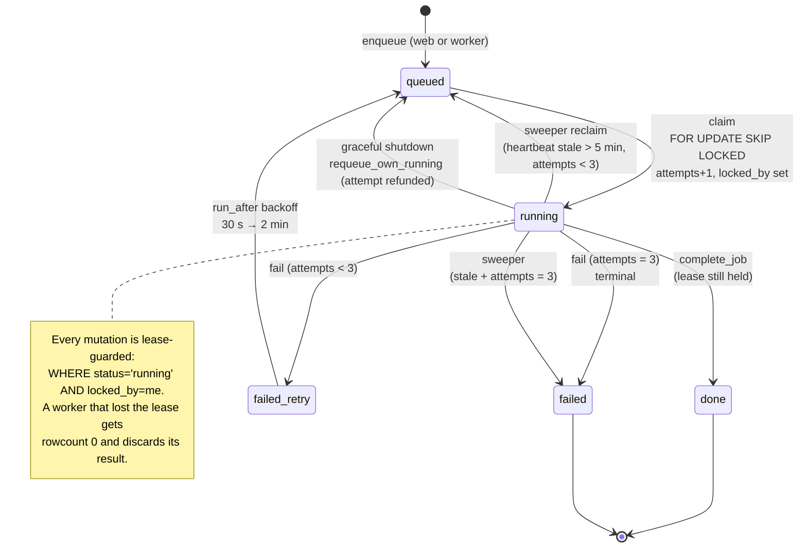
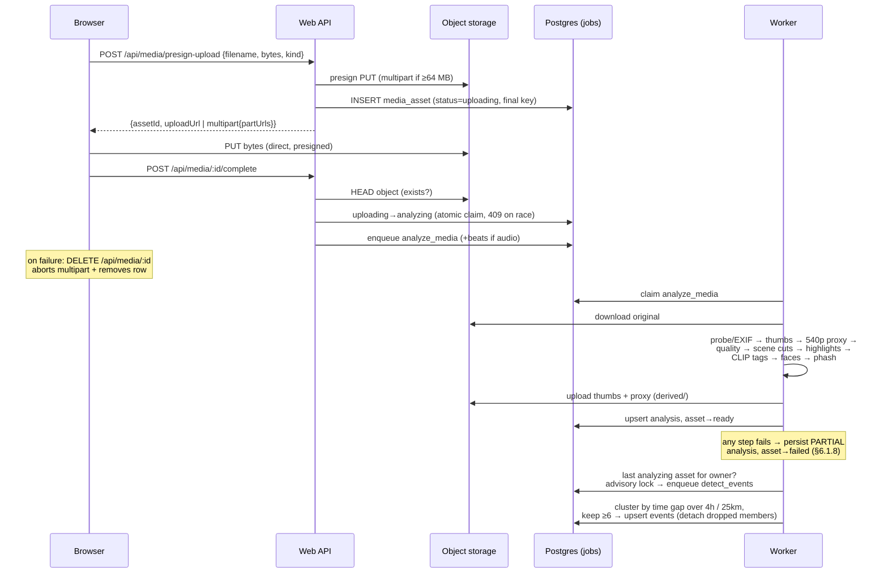
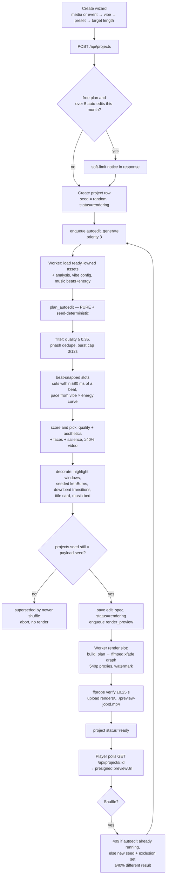
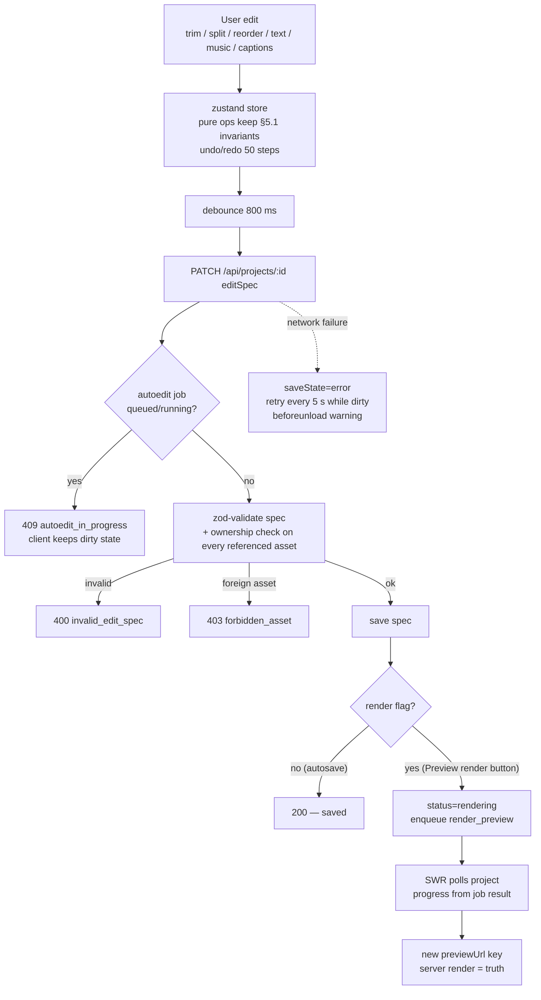
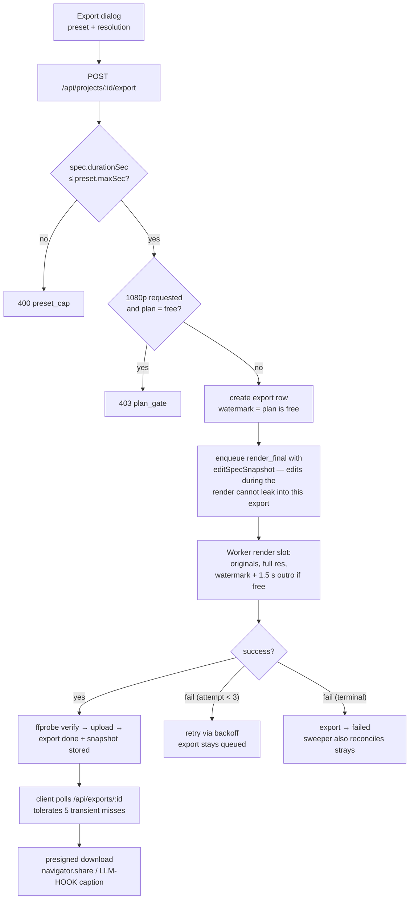
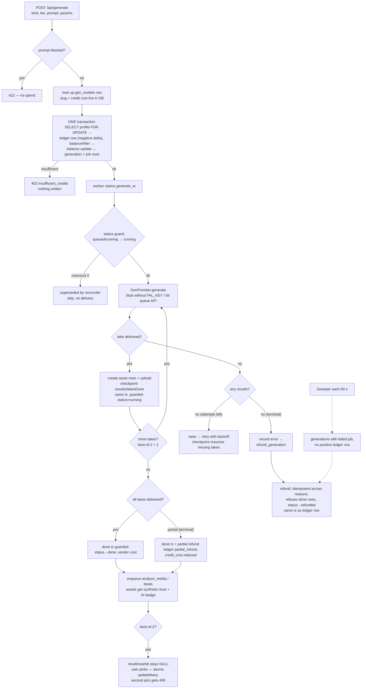
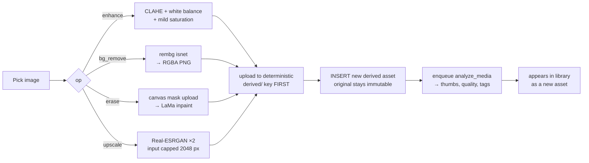
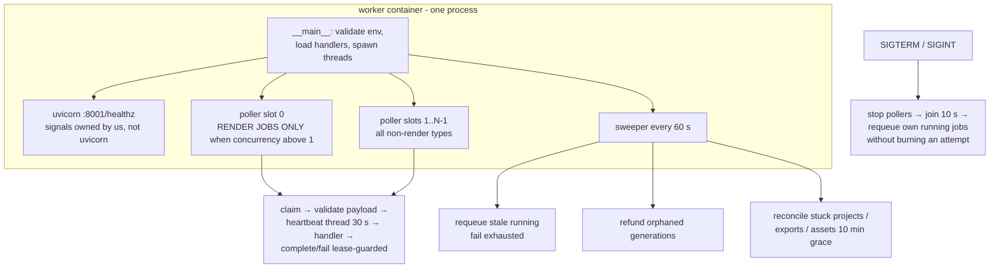

# ReelForge v1 — Flow Charts

> Companion documents: [ARCHITECTURE.md](./ARCHITECTURE.md) · [DEPLOYMENT.md](./DEPLOYMENT.md)
>
> All diagrams are Mermaid (rendered natively by GitHub).

## 1. Job lifecycle state machine

Every asynchronous operation in the system is a row in the `jobs` table and
follows this one state machine (`worker/lib/db.py`):

## 2. Upload → analysis → event clustering

## 3. Auto-edit: create wizard → plan → preview render

## 4. Editor: autosave and re-render

## 5. Export: plan gates → immutable final render

## 6. AI generation with credit lifecycle (SPEC §8)

## 7. Image studio operation

## 8. Worker process anatomy

